# SPENVIS を用いた宇宙陽子線環境の算出手順

**GEO・ISS 軌道における捕捉陽子線・太陽陽子線の算出と合算（AP-8 / AP-9 IRENE / ESP-PSYCHIC）**

このリポジトリは、[ESA SPENVIS](https://www.spenvis.oma.be) を使って軌道を定義し、捕捉陽子・太陽陽子のフラックス／フルエンスを取得して合算する手順をまとめたものです。

**SPENVIS 画面キャプチャについて:** 操作手順用のスクリーンショット（`inputs/images/` のうち SPENVIS Web 画面の撮影にあたる図）には、画面上に表示されている**コピーライト・クレジット・利用に関する表記**が含まれます。これらは **SPENVIS の提供元（European Space Agency が運営する SPENVIS 等、サービスが示す権利者）** に帰属します。第三者への提供や再掲載を行う場合は、[SPENVIS のサイト](https://www.spenvis.oma.be)で示される利用条件・著作権ポリシーを確認し、画面上の表記を改変・削除しないよう留意してください。

## このフォルダの内容

| パス | 説明 |
|------|------|
| **本文（この README）** | 操作手順・モデル設定・単位と合算・適用例を一覧できるプロジェクトのメイン説明です。 |
| [inputs/guide_spenvis.md](./inputs/guide_spenvis.md) | 同等構成の Markdown 原本です。**README と内容を対応させて編集・保守**してください。 |
| [inputs/images/](./inputs/images/) | スクリーンショットおよび結果プロット（`fig01`〜`fig16`、`eqflux_*.png` など。**README とガイドの画像リンクはすべてこのフォルダを参照します**。 |
| [inputs/Solar_cell_damage_equivalent_fluences.txt](./inputs/Solar_cell_damage_equivalent_fluences.txt) | シリコンセル・EQFULX のテキスト出力例（§9）。 |
| [inputs/MJ_Solar_cell_damage_equivalent_fluences](./inputs/MJ_Solar_cell_damage_equivalent_fluences) | 三接合（AZURE 3G30）・EQFULX のテキスト出力例（§9。拡張子なし）。 |
| [inputs/MJ_Solar_cell_damage_equivalent_fluences.pdf](./inputs/MJ_Solar_cell_damage_equivalent_fluences.pdf) | 上記に対応する PDF レポート（§9）。 |
| [inputs/geo_10yr_combined_proton_ap9.csv](./inputs/geo_10yr_combined_proton_ap9.csv) | GEO 10 年・Combined proton の例データ（AP-9 + ESP-PSYCHIC）。 |
| [inputs/iss_05yr_combined_proton.csv](./inputs/iss_05yr_combined_proton.csv) | ISS 軌道の Combined proton 例データ（ファイル名は `05yr` ですが、本文の適用例は 180 日条件です。条件とデータを揃える場合はファイル名または計算条件を更新してください）。 |
| [docs/guide_spenvis.docx](./docs/guide_spenvis.docx) | Word 形式の別出力（任意）。 |

## 目次

- [１．概要](#readme-sec-1)
- [２．共通手順：軌道の定義](#readme-sec-2)
- [３．捕捉陽子線の算出](#readme-sec-3)
- [４．太陽陽子線の算出](#readme-sec-4)
- [５．データ整形と合算](#readme-sec-5)
- [６．適用例1: GEO軌道（10年）](#readme-sec-6)
- [７．適用例2: ISS軌道（180日）](#readme-sec-7)
- [８．GEOとISSの比較](#readme-sec-8)
- [９．太陽電池の軌道上での性能予測](#readme-sec-9)
- [１０．注意事項](#readme-sec-10)
- [参考文献](#readme-refs)

---

## １．概要

### 1.1 SPENVISとは

SPENVIS（https://www.spenvis.oma.be）は、ESAが提供するWebベースの宇宙環境解析ツールである。放射線環境、帯電、大気、磁場などのモデルを統合的に利用できる。利用にはアカウント登録（無料）が必要。

### 1.2 軌道別の陽子線環境の特徴

| Orbit | Trapped protons | Solar protons | Dominant source |
|-------|----------------|---------------|-----------------|
| ISS (410km, 51.6°) | Strong (SAA) | Zero (geomag. shielding 99.9%) | Trapped only |
| GEO (35,793km) | Sub-MeV only (L=6.6) | Dominant above ~2.5 MeV | Both contribute |
| Interplanetary | None | Dominant | Solar only |

*Table 1: 軌道別の陽子線環境*

### 1.3 使用するモデル

| Model | Target | Note |
|-------|--------|------|
| AP-8 MIN/MAX | Trapped protons | 1960s data, legacy standard |
| AP-9 (IRENE) | Trapped protons | Van Allen Probes data, recommended |
| AE-8 / AE-9 | Trapped electrons | GEO: dominant for Dd |
| ESP-PSYCHIC | Solar protons | ECSS standard, CL-dependent |
| SAPPHIRE | Solar protons | Alternative to ESP-PSYCHIC |

*Table 2: 主な放射線環境モデル*

### 1.4 SPENVIS の基本操作（プロジェクトと結果の閲覧）

- **プロジェクト数の上限**: 1 アカウントあたり保持できるプロジェクトは **最大 2 件**です。上限に達している場合は、画面上部に新規作成できない旨のメッセージが表示され、Project management の **Action** にある「Create a new project」が選択できない／無効になることがあります。
- **プロジェクトの追加・切り替え・削除など**: 画面上部の **「SPENVIS Project: （プロジェクト名）」** をクリックすると **Project management** が開きます。**Action** のドロップダウンから、現在のプロジェクトの設定編集・結果の削除、別プロジェクトへの切り替え・プロジェクトの削除・ZIP でのダウンロード、新規プロジェクトの作成（上限未満のとき）などを行います。
- **実行結果の閲覧**: **現在選択中のプロジェクト**の画面で、**右上の「Output」** をクリックすると **Tables and plots**（レポート・データ表・図へのリンク一覧）が開きます。本ガイドではこの画面を **Output ページ** と呼びます。

---

## ２．共通手順：軌道の定義

### Step 1: プロジェクト作成

SPENVIS にログインしたら、画面上部の **「SPENVIS Project: …」** をクリックして **Project management** を開き、利用するプロジェクトを選択するか、上限に余裕があれば新規に作成します（§1.4）。その後、Model packages で **Spacecraft trajectories** をクリックして軌道定義に進みます。メニューの **Project > New** などからプロジェクトを作成できる場合もありますが、主な操作はヘッダーのプロジェクト名リンクから行います。

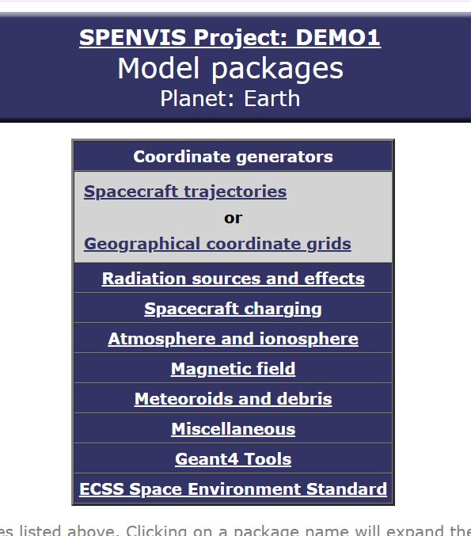

*Fig. 1: Model Packagesページ*

### Step 2: ミッション定義

Mission durationを設定する。**Representative trajectory durationを「1 days」に設定**することが重要。特にISSなどのLEO軌道では、この値が小さいとSAA通過がサンプリングされず、捕捉粒子フラックスがゼロとなる。

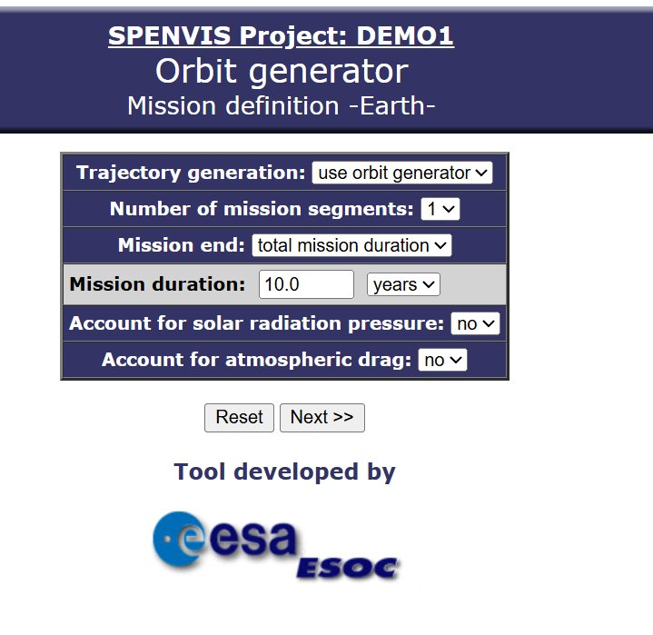

*Fig. 2: Mission definition画面*

### Step 3: 軌道タイプの選択

| Orbit | Type | Key parameters |
|-------|------|---------------|
| GEO | geostationary | Auto-set (35,793 km, i=0°) |
| ISS | general (circular) | Alt=410 km, Inc=51.6° |
| SSO | heliosynchronous | Altitude, LTAN |

*Table 3: 軌道タイプの設定例*

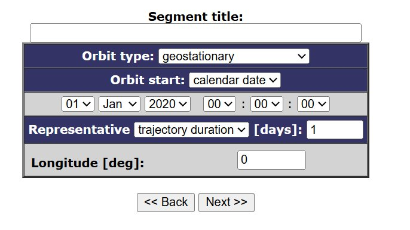

*Fig. 3: 軌道タイプ選択（GEOの例）*

### Step 4: 軌道生成・確認

設定確認後、Runをクリック。Mission overviewでパラメータを確認する。

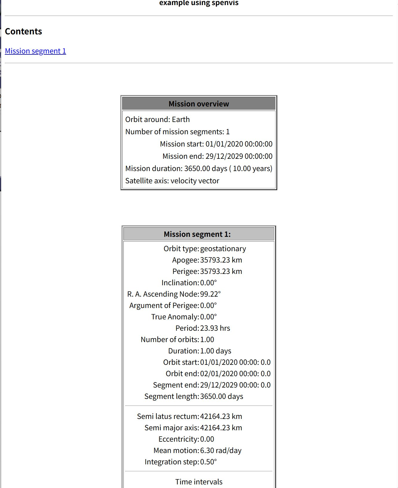

*Fig. 4: Mission overview（GEOの例）*

---

## ３．捕捉陽子線の算出

§1.4 のとおり、現在選択中のプロジェクト画面の右上 **Output** から **Tables and plots**（Output ページ）を開いたうえで、以下のモデルを選択します。

### 3.1 AP-8モデル

Radiation sources and effects セクションから**Trapped proton and electron fluxes**を選択する。

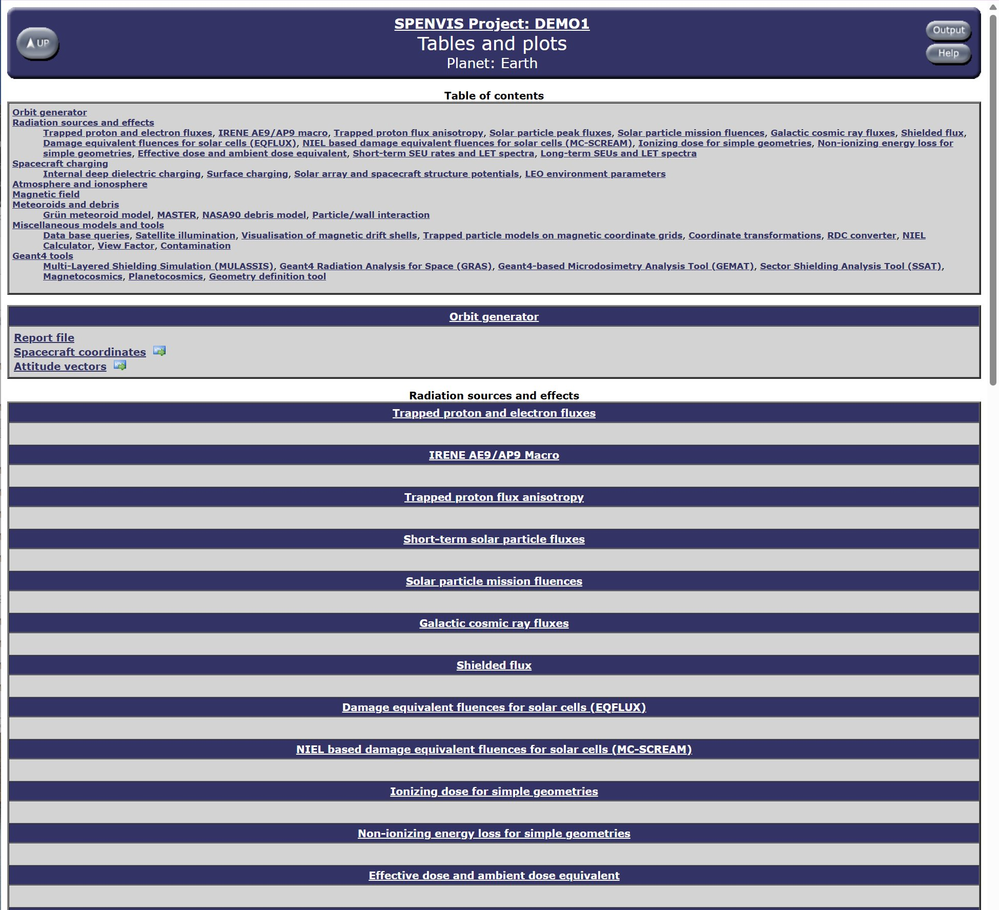

*Fig. 5: Tables and plotsページ（右上 Output から開く）*

| Parameter | Setting | Note |
|-----------|---------|------|
| Proton model | AP-8 MIN / MAX | MIN=solar min, MAX=solar max |
| Electron model | AE-8 MIN / MAX | Dd計算に必要 |

*Table 4: AP-8モデル設定*

AP-8の出力は**flux**（cm⁻² s⁻¹ MeV⁻¹）であり、ミッション期間（秒）を掛けてfluenceに変換する必要がある。

### 3.2 AP-9（IRENE）モデル（推奨）

AP-9はVan Allen Probesの観測データを反映した新しいモデルであり、特に高L値領域（GEO等）での精度が向上している。Output ページの **IRENE AE9/AP9 Macro** を選択する。

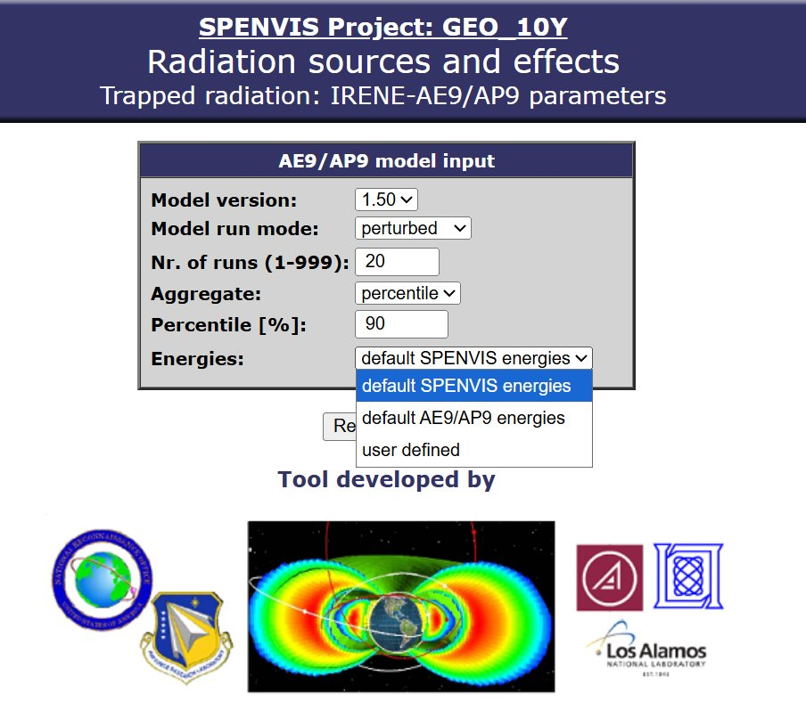

*Fig. 6: IRENE AE9/AP9パラメータ設定画面*

| Parameter | Setting | Note |
|-----------|---------|------|
| Model version | 1.50 | Van Allen Probes data |
| Model run mode | perturbed | Statistical variation included |
| Nr. of runs | 20 | Monte Carlo trials |
| Aggregate | percentile | |
| Percentile | 50 | 50th=mean, 95th=design |
| Energies | default SPENVIS energies | AP-8と同じグリッドで比較しやすい |

*Table 5: AP-9モデル設定*

### 3.3 AP-8とAP-9の比較（GEO）

GEO軌道でのAP-8とAP-9の比較結果を以下に示す。0.1〜0.7 MeVではAP-9はAP-8の0.4〜0.8倍とやや低いが、同オーダーである。1 MeV以上ではAP-9の方が高く、AP-8が2 MeVでゼロとなるのに対しAP-9は7 MeVまで非ゼロの値を予測する。

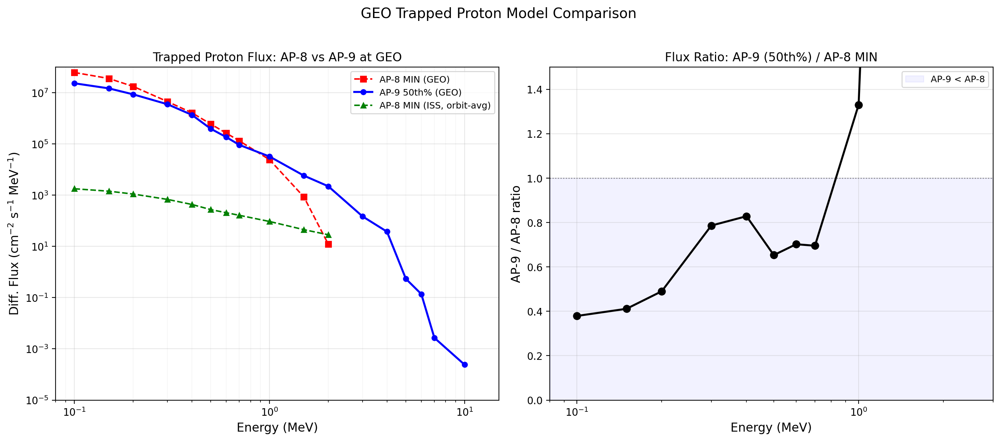

*Fig. 7: GEOにおけるAP-8とAP-9の捕捉陽子線フラックス比較*

---

## ４．太陽陽子線の算出

§1.4・§3 と同様に Output ページを開き、**Solar particle mission fluences** を選択する。

| Parameter | Setting | Note |
|-----------|---------|------|
| Model | ESP-PSYCHIC (total fluence) | ECSS standard |
| Ion range | H - U | Protons sufficient for Dd |
| Confidence level | 90 (%) | 95% for conservative design |
| Magnetic shielding | yes | GEO: atten.~0.994, ISS: 0.001 |

*Table 6: ESP-PSYCHIC設定*

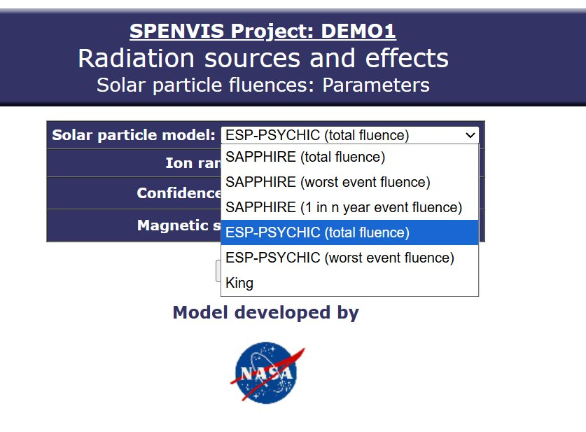

*Fig. 8: ESP-PSYCHICモデル選択画面*

ESP-PSYCHICの出力は直接**fluence**（cm⁻² MeV⁻¹）であり、AP-8/AP-9のようなfluxからの変換は不要である。

**注意:** ISS軌道（410 km, 51.6°）では地磁気遮蔽の減衰率が0.0009（99.9%遮蔽）であり、太陽陽子線フルエンスは全エネルギーでゼロとなる。一方、GEOでは減衰率が0.994でほぼ全量が到達する。

---

## ５．データ整形と合算

### 5.1 単位の統一

| Model | Output unit | Conversion |
|-------|-------------|------------|
| AP-8 / AP-9 | Flux (cm⁻² s⁻¹ MeV⁻¹) | × mission seconds |
| ESP-PSYCHIC | Fluence (cm⁻² MeV⁻¹) | No conversion needed |

*Table 7: 単位の違いと変換*

| Duration | Seconds |
|----------|---------|
| 0.5 years (180 days) | 1.556 × 10⁷ |
| 1 year | 3.156 × 10⁷ |
| 5 years | 1.578 × 10⁸ |
| 10 years | 3.156 × 10⁸ |

*Table 8: ミッション期間の秒数変換*

### 5.2 合算方法

Combined fluenceは、各エネルギー点でTrapped fluenceとSolar fluenceを足し算する。

Fcombined(E) = Ftrapped(E) + Fsolar(E)

TrappedのエネルギーグリッドがSolarと異なる場合は、対数線形補間でSolarのグリッドに合わせる。

---

## ６．適用例1: GEO軌道（10年）

### 6.1 計算条件

| Item | Value |
|------|-------|
| Orbit | GEO (35,793 km, i=0°) |
| Duration | 10 years |
| Trapped proton | AP-9 V1.50, 50th percentile |
| Solar proton | ESP-PSYCHIC, 90% CL |
| Trapped electron | AE-9 (for Dd calculation) |

### 6.2 Trapped vs Solarの支配領域

GEOでは約2.5 MeVを境に、それ以下ではTrapped protonが支配的、それ以上ではSolar protonが支配的である。この結論はAP-8とAP-9の両モデルで一致しており、モデルに依存しない堅牢な結果である。

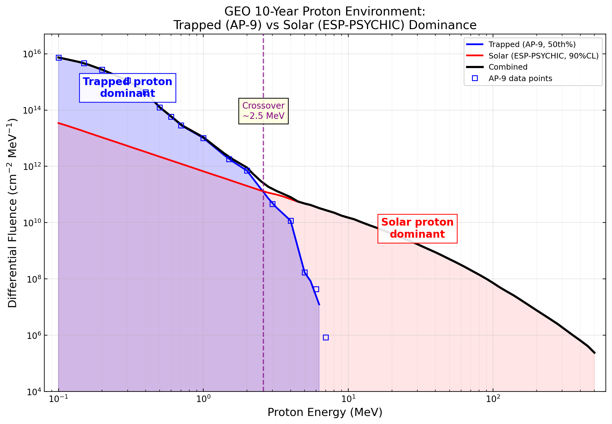

*Fig. 9: GEOのTrapped vs Solar支配領域（AP-9使用）*

### 6.3 Combined Proton Fluence

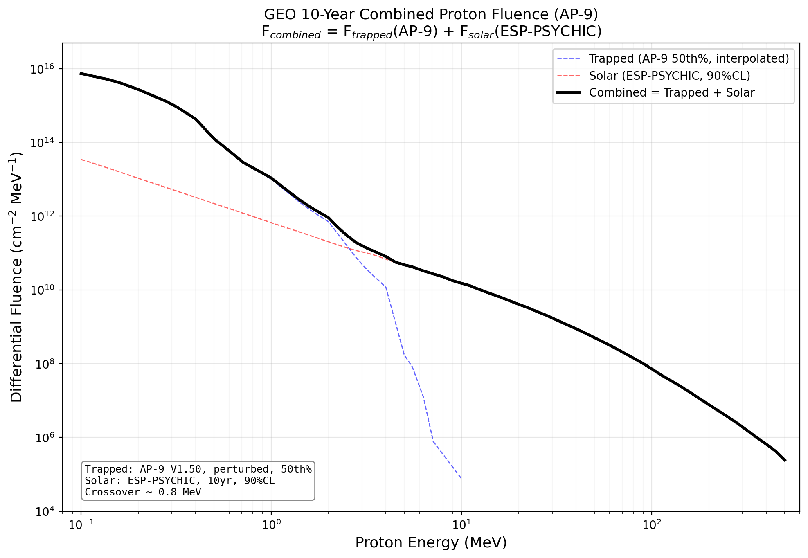

*Fig. 10: GEO 10年間Combined Proton Fluence（AP-9 + ESP-PSYCHIC）*

---

## ７．適用例2: ISS軌道（180日）

### 7.1 計算条件

| Item | Value |
|------|-------|
| Orbit | ISS (410 km, i=51.6°, circular) |
| Duration | 180 days (0.5 years) |
| Trajectory sampling | 1 day (15.52 orbits) |
| Trapped proton | AP-8 MIN |
| Solar proton | ESP-PSYCHIC, 90% CL |

**重要:** ISS軌道ではRepresentative trajectory durationを必ず**1 day**に設定する。ISSの軌道周期は約1.55時間であり、1周回や数分ではSAA通過がサンプリングされず、捕捉粒子フラックスがゼロとなる。

### 7.2 結果

ISS軌道では太陽陽子線フルエンスが**全エネルギーでゼロ**となった。地磁気遮蔽の減衰率が0.0009（99.9%遮蔽）であり、太陽陽子線はほぼ到達しない。したがって、**ISS軌道のCombined proton = Trapped protonのみ**である。捕捉陽子線は0.1〜300 MeVの広いエネルギー範囲にわたり、SAA通過による軌道平均フルエンスである。

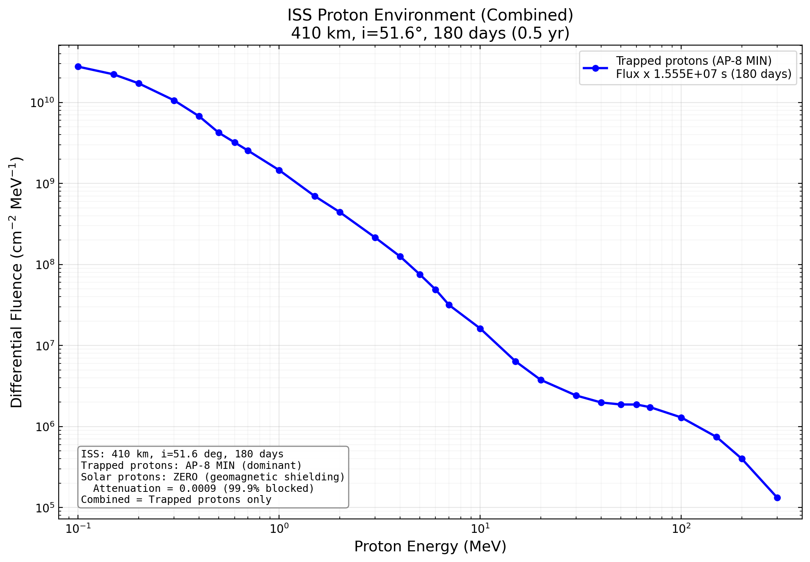

*Fig. 11: ISS 180日間Combined Proton Fluence（= Trapped only）*

---

## ８．GEOとISSの比較

GEOとISSの捕捉陽子線フラックスを比較すると、以下の特徴が確認できる。

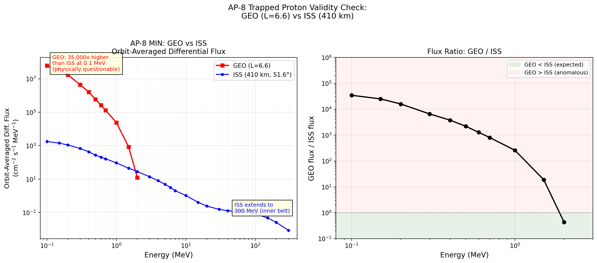

*Fig. 12: GEO vs ISS 捕捉陽子線フラックス比較*

**GEO（L=6.6）:** 低エネルギー（0.1〜2 MeV）のみに捕捉陽子線が存在。絶対値は大きいが、エネルギー範囲が狭い。AP-8とAP-9で同程度の値が得られ、物理的に存在する集団と考えられる。

**ISS（410 km, 51.6°）:** 軌道平均フラックスは低いが（SAA duty cycle約10-15%による希釈）、0.1〜300 MeVの広いエネルギー範囲に捕捉陽子線が存在する。

---

## ９．太陽電池の軌道上での性能予測

GEO などの軌道における太陽電池の放射線劣化を扱う際、粒子フラックスだけでなく **1 MeV 電子等価フルエンス（electron equivalent fluence）** で評価することがある。SPENVIS の **Solar cell radiation damage** にある **Damage equivalent fluences for solar cells（EQFULX）** を用いると、捕捉陽子・太陽陽子・捕捉電子の寄与をカバーガラス厚さごとに換算できる。

以下の手順・図は、本文 §6 と同一条件の **GEO・10 年・Si セル** を例とする（軌道・放射線モデルはプロジェクト側の設定に依存する）。

### 9.1 SPENVIS での操作

1. **モデルの選択**  
   Model packages で **Miscellaneous** を開き、**Solar cell radiation damage** の **Damage equivalent fluences for solar cells（EQFULX）** を選ぶ（Fig. 13）。

   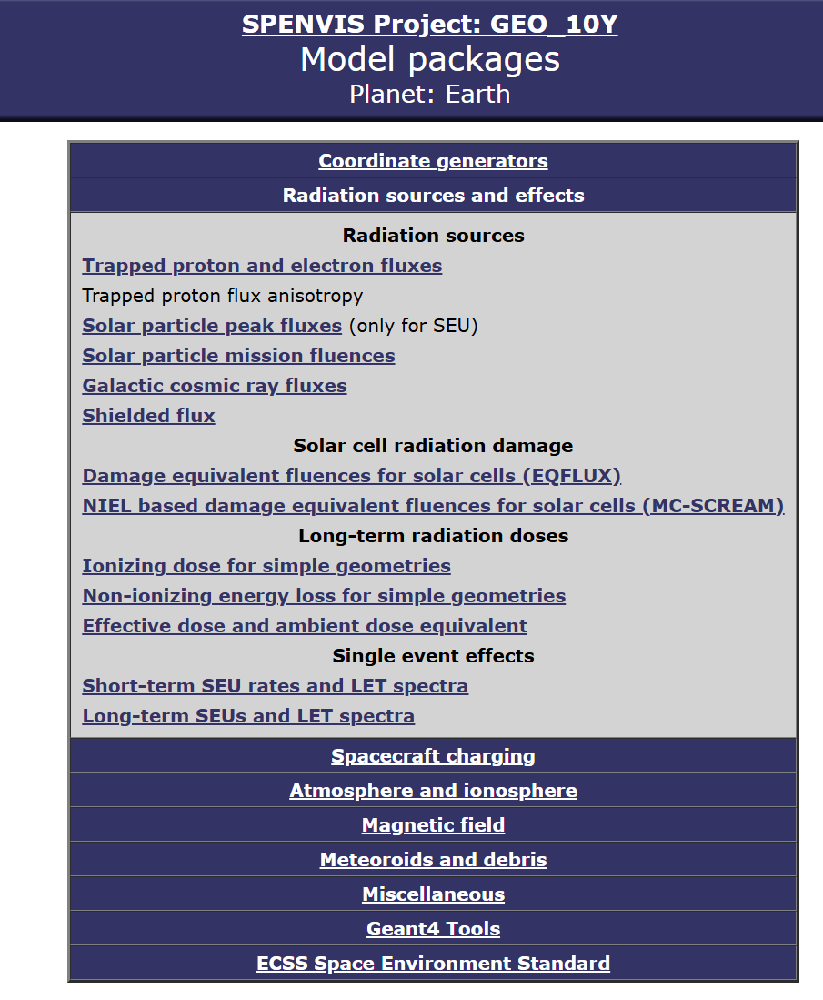

   *Fig. 13: Solar cell radiation damage で EQFULX を選択*

2. **パラメータ設定と実行**  
   太陽電池の種類（例: Si）、カバーガラスの厚みリスト、電子／陽子ダメージ比（Pmax / Voc / Isc）などを設定し **Run**（Fig. 14）。

   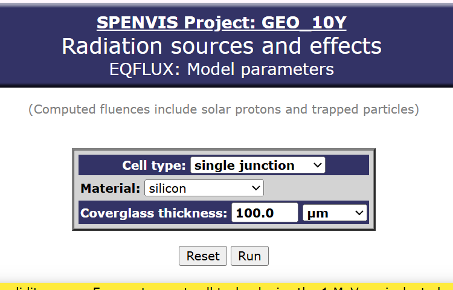

   *Fig. 14: EQFULX の設定例（セル種・カバーガラス厚さなど）*

3. **結果画面（Output）**  
   §1.4 のとおり、プロジェクト画面右上の **Output** から **Tables and plots** を開くと、Solar cell radiation damage の結果一覧が表示される（Fig. 15）。

   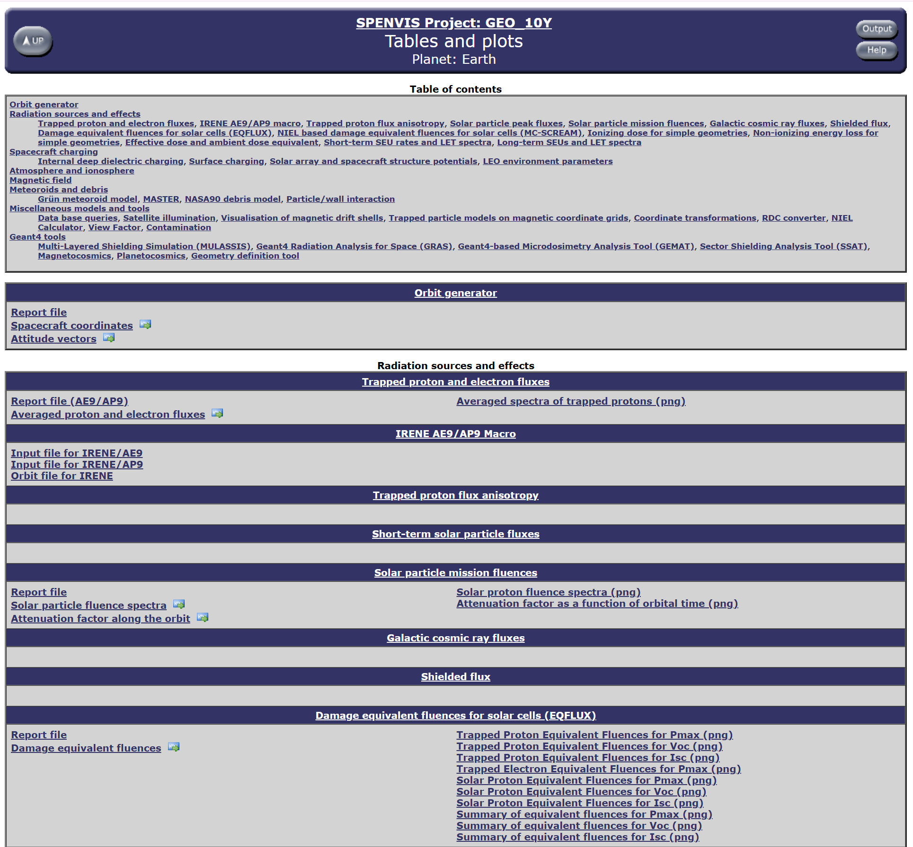

   *Fig. 15: Tables and plots 上の Solar cell radiation damage 結果*

4. **詳細プロット**  
   **Damage_equivalent_fluences_for_solar_cells** のリンクを開くと、スペクトル別の等価フルエンス図などが表示される（Fig. 16）。

   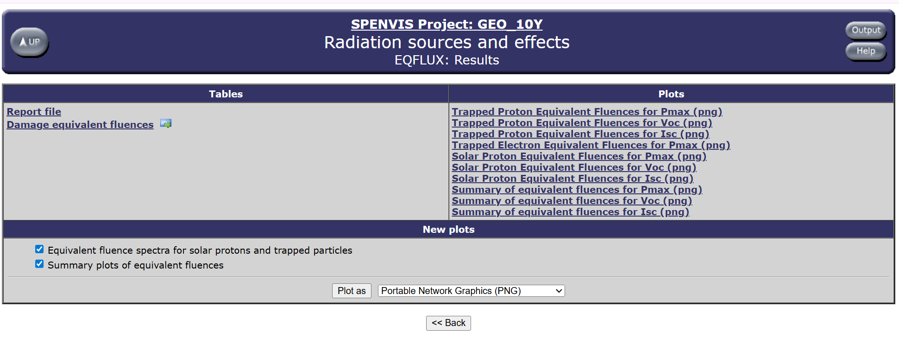

   *Fig. 16: Damage equivalent fluences for solar cells の表示例*

5. **レポート・テキスト出力**  
   画面左の **Report** から PDF を取得できる（セル種によりファイル名が変わる）。シリコン計算の例は [inputs/Solar_cell_damage_equivalent_fluences.txt](./inputs/Solar_cell_damage_equivalent_fluences.txt)、三接合 AZURE 3G30 の例は [inputs/MJ_Solar_cell_damage_equivalent_fluences.pdf](./inputs/MJ_Solar_cell_damage_equivalent_fluences.pdf) およびテキスト [inputs/MJ_Solar_cell_damage_equivalent_fluences](./inputs/MJ_Solar_cell_damage_equivalent_fluences) に相当する出力である。

### 9.2 代表結果（スペクトル別・SPENVIS 図）

同一条件下で SPENVIS が出力する **差分スペクトル**（カバーガラス厚さが増えるほど低エネルギー側が遮蔽される様子）の例を Fig. 17〜19 に示す。いずれも **Pmax** に対する等価フルエンスである。

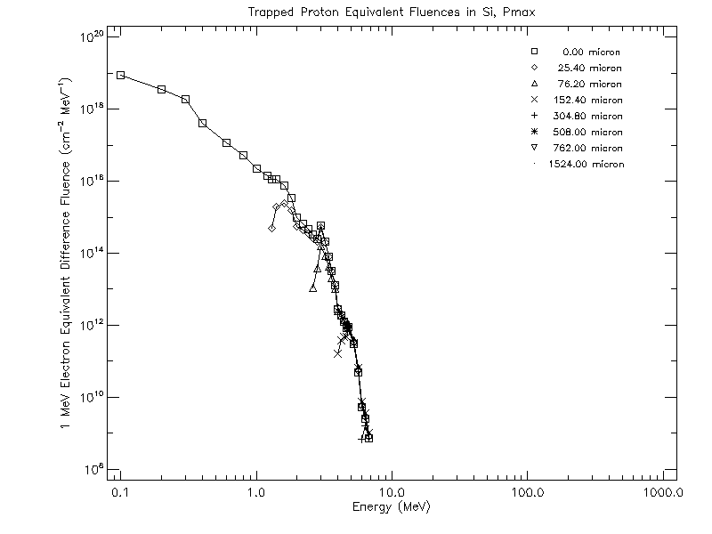

*Fig. 17: Trapped proton equivalent fluences for Pmax（カバーガラス厚さ別）*

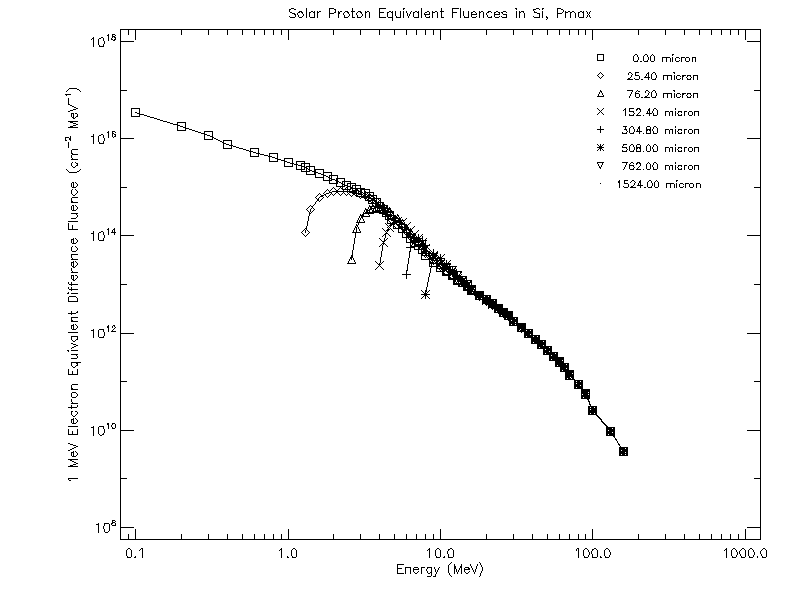

*Fig. 18: Solar proton equivalent fluences for Pmax（カバーガラス厚さ別）*

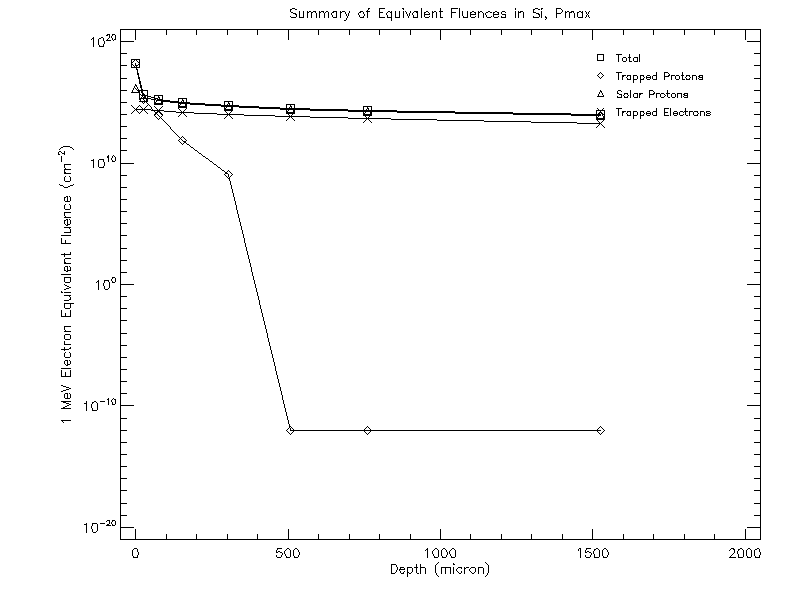

*Fig. 19: Summary of equivalent fluences for Pmax（総量と成分別の概観；ファイル名 `eqflux_sp.png`）*

### 9.3 代表結果（カバーガラス厚さ別・積算値）

テキスト出力の **Summary of Equivalent Fluences …, Pmax**（深度＝カバーガラス表面からの厚さ、単位 cm⁻²）を、**シリコン単結晶**と**三接合 AZURE 3G30**（SPENVIS のセル種名は *Azur 3G30 (SR-NIEL 21eV)*）について同じ形式で示す。いずれも軌道・ミッション期間・放射線モデルは §6 の GEO 10 年例と揃えてある。捕捉陽子が極厚ガラスで実質ゼロに近づく一方、太陽陽子・捕捉電子の寄与が残る傾向は共通だが、総量・成分比はセル種で異なる。

**シリコン（Si）** — [Solar_cell_damage_equivalent_fluences.txt](./inputs/Solar_cell_damage_equivalent_fluences.txt)

| Cover glass (μm) | Total Φ_eq | Trapped protons | Solar protons | Trapped electrons |
|------------------|------------|-----------------|---------------|-------------------|
| 0 | 1.54 × 10¹⁸ | 1.53 × 10¹⁸ | 1.49 × 10¹⁶ | 2.80 × 10¹⁴ |
| 25.4 | 4.74 × 10¹⁵ | 1.75 × 10¹⁵ | 2.75 × 10¹⁵ | 2.39 × 10¹⁴ |
| 76.2 | 1.65 × 10¹⁵ | 7.62 × 10¹³ | 1.38 × 10¹⁵ | 1.95 × 10¹⁴ |
| 152.4 | 9.60 × 10¹⁴ | 7.51 × 10¹¹ | 8.05 × 10¹⁴ | 1.55 × 10¹⁴ |
| 304.8 | 5.43 × 10¹⁴ | 1.20 × 10⁹ | 4.35 × 10¹⁴ | 1.08 × 10¹⁴ |
| 508 | 3.26 × 10¹⁴ | ≈ 0 * | 2.52 × 10¹⁴ | 7.35 × 10¹³ |
| 762 | 2.19 × 10¹⁴ | ≈ 0 * | 1.69 × 10¹⁴ | 4.94 × 10¹³ |
| 1524 | 1.01 × 10¹⁴ | ≈ 0 * | 8.26 × 10¹³ | 1.88 × 10¹³ |

*Table 9: Si における 1 MeV 電子等価フルエンス（Pmax）のカバーガラス厚さ依存*

**三接合（AZURE 3G30）** — [MJ_Solar_cell_damage_equivalent_fluences](./inputs/MJ_Solar_cell_damage_equivalent_fluences)／[MJ_Solar_cell_damage_equivalent_fluences.pdf](./inputs/MJ_Solar_cell_damage_equivalent_fluences.pdf)

| Cover glass (μm) | Total Φ_eq | Trapped protons | Solar protons | Trapped electrons |
|------------------|------------|-----------------|---------------|-------------------|
| 0 | 1.29 × 10¹⁹ | 1.29 × 10¹⁹ | 6.25 × 10¹⁶ | 1.63 × 10¹⁴ |
| 25.4 | 2.48 × 10¹⁵ | 1.23 × 10¹⁵ | 1.11 × 10¹⁵ | 1.42 × 10¹⁴ |
| 76.2 | 5.71 × 10¹⁴ | 3.73 × 10¹³ | 4.15 × 10¹⁴ | 1.19 × 10¹⁴ |
| 152.4 | 3.19 × 10¹⁴ | 1.95 × 10¹¹ | 2.21 × 10¹⁴ | 9.78 × 10¹³ |
| 304.8 | 1.82 × 10¹⁴ | 6.71 × 10⁷ | 1.11 × 10¹⁴ | 7.08 × 10¹³ |
| 508 | 1.18 × 10¹⁴ | ≈ 0 * | 6.85 × 10¹³ | 4.99 × 10¹³ |
| 762 | 8.06 × 10¹³ | ≈ 0 * | 4.66 × 10¹³ | 3.41 × 10¹³ |
| 1524 | 3.38 × 10¹³ | ≈ 0 * | 2.09 × 10¹³ | 1.28 × 10¹³ |

\* 厚いガラスでは捕捉陽子成分が 10⁻¹² cm⁻² 程度まで下がる行があり、表中では実質ゼロとして示している。

*Table 10: AZURE（Azur）3G30 における 1 MeV 電子等価フルエンス（Pmax）のカバーガラス厚さ依存*

---

## １０．注意事項

**軌道サンプリング:** LEO軌道ではRepresentative trajectory durationを1 dayに設定すること。短い設定ではSAAがサンプルされず、捕捉粒子フラックスがゼロとなる。

**AP-8 flux→fluence変換:** AP-8/AP-9の出力はfluxであり、ミッション期間（秒）を掛けてfluenceに変換する。ESP-PSYCHICは直接fluenceで出力される。

**信頼水準:** ESP-PSYCHICの出力はCLに依存する。90%と95%で数倍の差がある。AP-8/AP-9にはこの概念はない（AP-9はpercentileで指定）。

**モデル選択:** 新規設計にはAP-9（IRENE）を推奨する。AP-8は1960年代のデータに基づくレガシーモデルであり、特に高L値領域での精度が不十分である。

**電子線:** GEOでの太陽電池劣化予測では、陽子線に加えて捕捉電子線（AE-8/AE-9）の計算も必要。GEOでは捕捉電子線がDdの主要因となりうる。

---

## 参考文献

[1] SPENVIS - Space Environment Information System, https://www.spenvis.oma.be

[2] SPENVIS Help: Solar proton models, https://www.spenvis.oma.be/help/background/flare/flare.html

[3] SPENVIS Help: Trapped particle radiation, https://www.spenvis.oma.be/help/background/traprad/traprad.html

[4] IRENE AE9/AP9 V1.58, https://www.vdl.afrl.af.mil/programs/ae9ap9/downloads.php

[5] G. P. Ginet et al., "AE9, AP9 and SPM: New models for specifying the trapped energetic particle and space plasma environment," Space Sci. Rev., 179, 579-615, 2013.

[6] M. A. Xapsos et al., "Probability Model for Cumulative Solar Proton Event Fluences," IEEE TNS, 47(3), 486-490, 2000.

[7] P. Jiggens et al., "Updated Model of the Solar Energetic Proton Environment in Space," JSWSC, 8, A31, 2018.

[8] D. M. Sawyer and J. I. Vette, "AP-8 Trapped Proton Environment," NSSDC/WDC-A-R&S 76-06, 1976.
